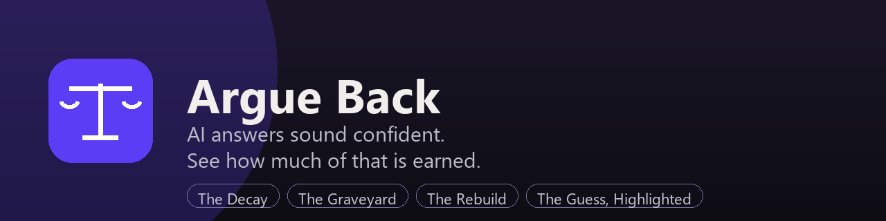
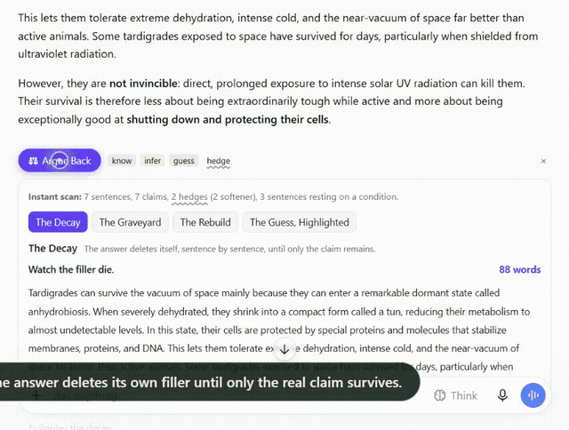
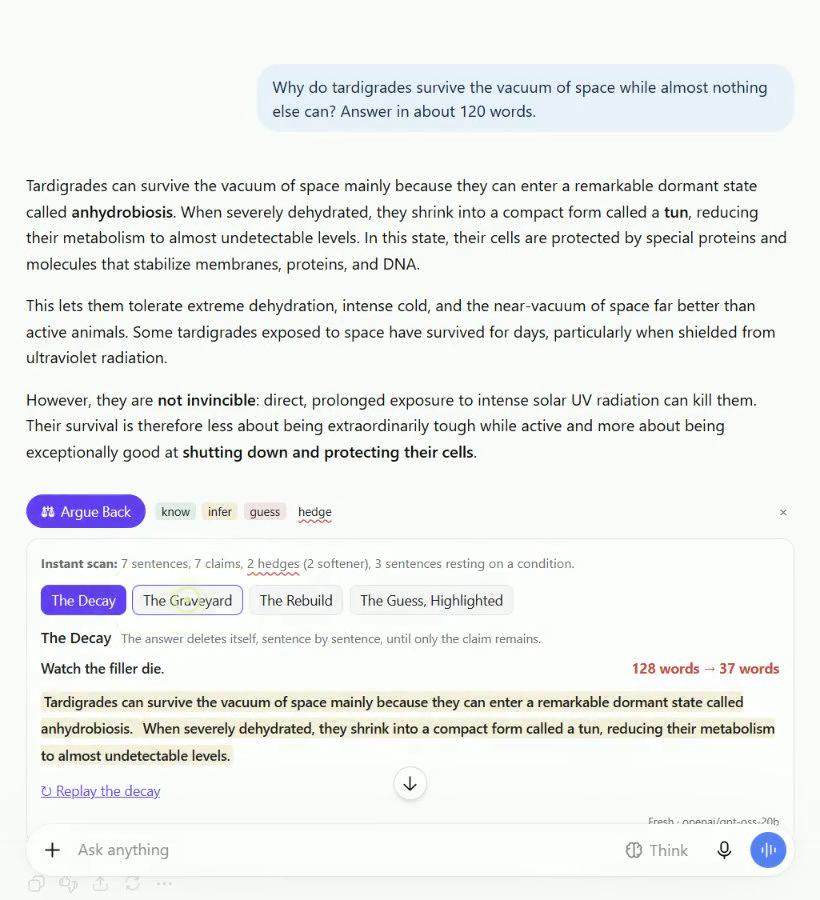
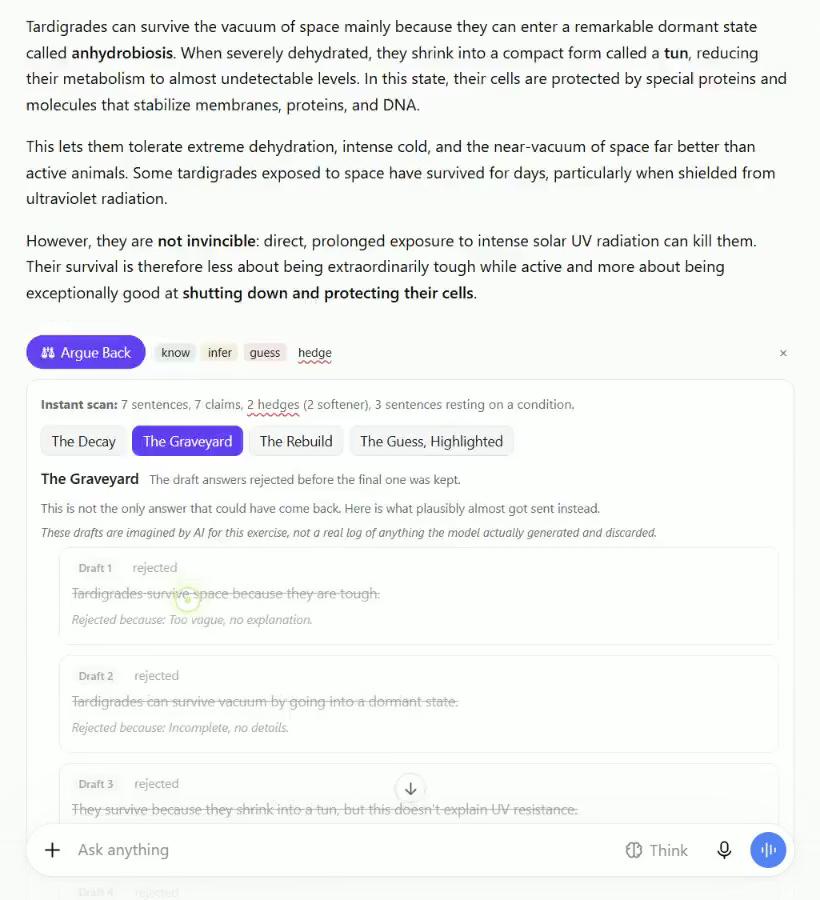
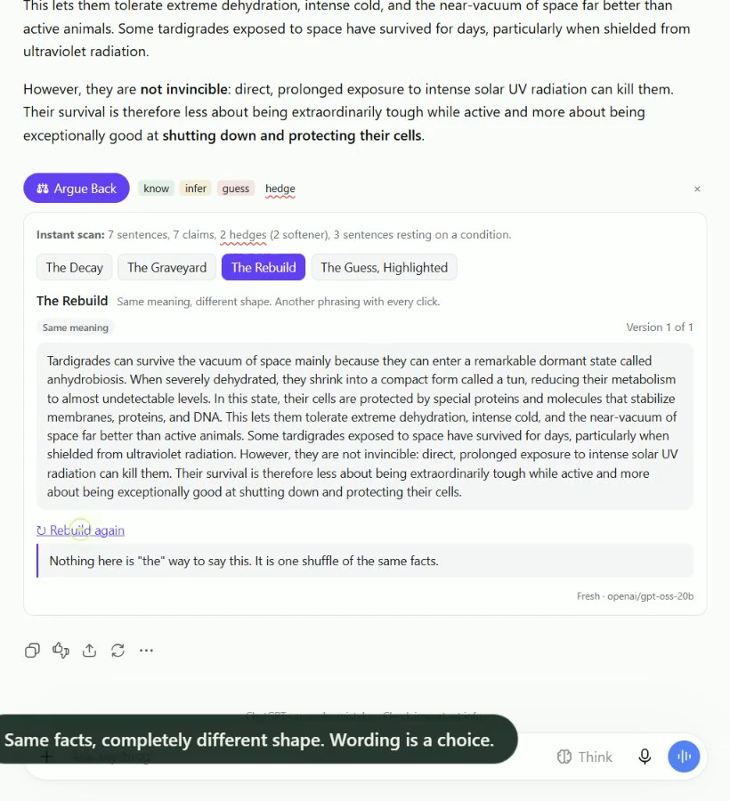
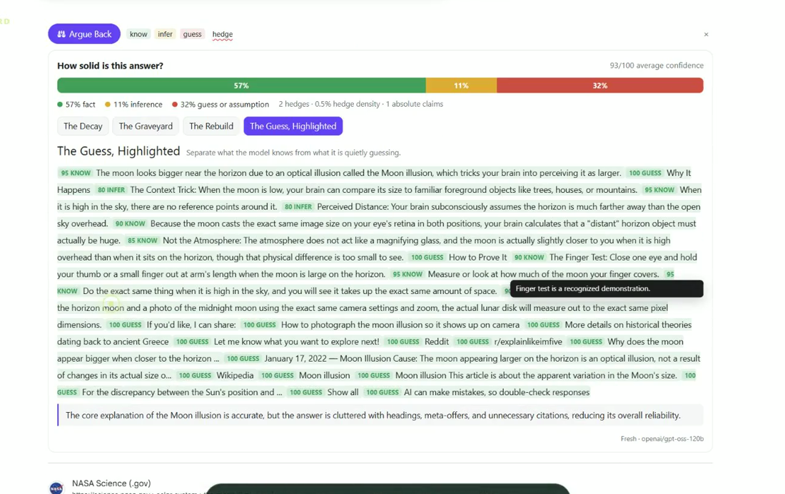
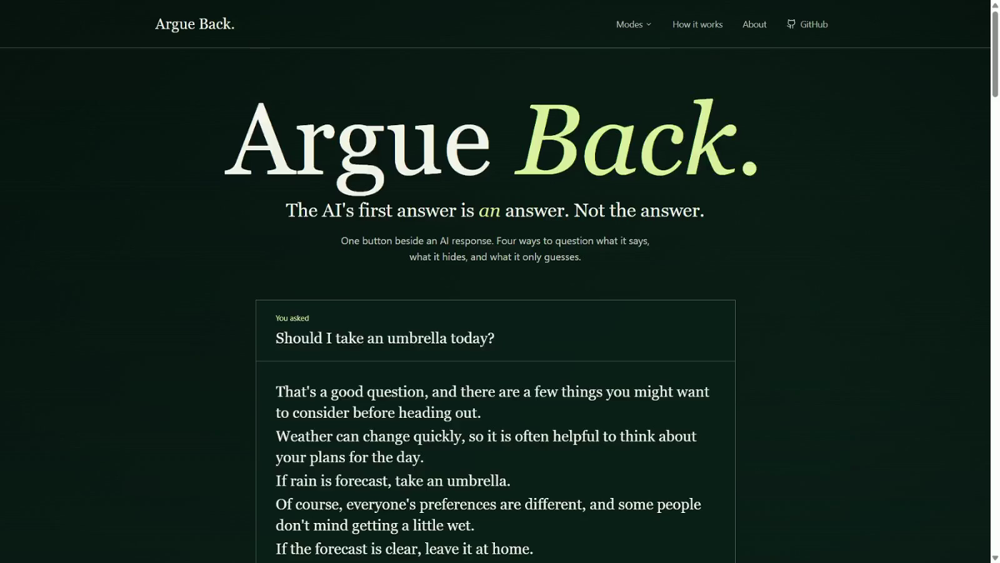
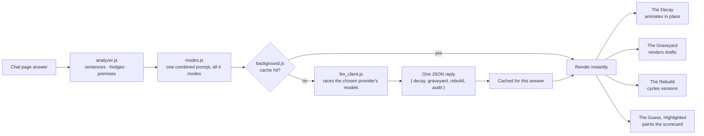
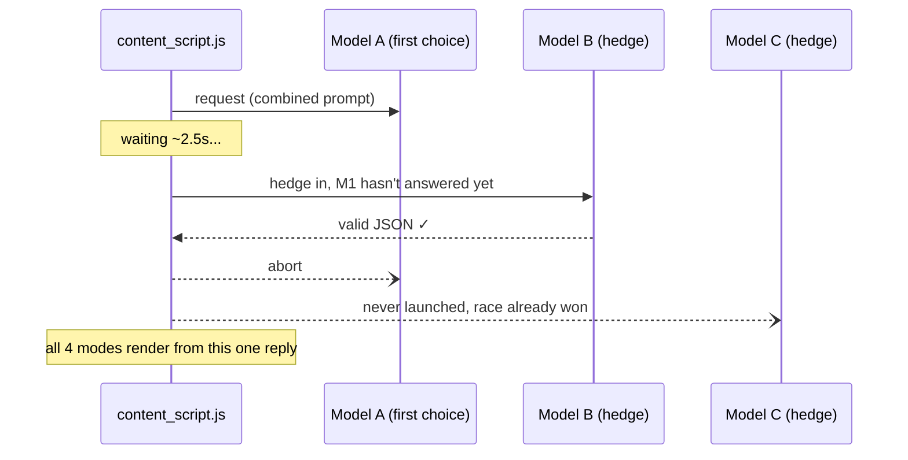

<p align="center">
  
</p>

# Argue Back

**AI answers sound confident. Argue Back shows you how much of that confidence is earned.**

**Live site:** [argue-back.vercel.app](https://argue-back.vercel.app)

Argue Back is a Chrome extension that adds one button under every AI chat answer. Click it and the answer does not change. Instead, it gets taken apart in place, four different ways: watch it delete its own filler down to the real claim, see the drafts that got rejected before this one was kept, watch it get rephrased on the spot, or have every sentence marked as something the model **knows**, **infers**, or is quietly **guessing**.

## The problem

When you ask an AI a question, you get back a clean, well written paragraph. It reads like a textbook. But inside that paragraph, a solid fact sits right next to a lucky guess, and they look exactly the same.

Every other tool in this space tries to fix that by generating a *better* answer. That just gives you another confident paragraph with the same problem.

We went the other way. **We don't regenerate anything.** We take apart the answer you already have.

## The four modes

### The Decay
The answer deletes itself, sentence by sentence, live, until only the claim remains. Each sentence fades and blurs out before it disappears, and a word counter ticks down next to it, *"107 words &rarr; 18 words."* By the end, only the one or two sentences carrying the actual answer are left standing. Everything else was scaffolding, and now you watched it die.

### The Graveyard
Instead of just the final answer, this reveals the drafts that came before it. Several rejected versions appear, greyed out and struck through, each with a one line reason it didn't make the cut, some worse, some arguably better, one even cut off mid-sentence. The kept draft, the one you were actually shown, sits at the bottom, highlighted. The answer you got was a choice, not the only thing that could have been said.

### The Rebuild
Click it, and the same answer reappears, same facts, same conclusion, but phrased and structured completely differently. Click it again, and it changes again. After a couple of rebuilds it's obvious there was never one correct way to phrase this. The wording is a choice made separately from the substance.

### The Guess, Highlighted
Every sentence gets color coded: green for something the model actually knows, yellow for something it's inferring, red for something it's quietly guessing and hoping sounds right. Hover any sentence for the reason. At the end there's a scorecard: *50% fact, 40% inference, 10% guess*, with an average confidence score.

## Screenshots

All of these are real captures of the extension running on live answers, not mockups.

<p align="center">
  
  <br><sub>The Decay on ChatGPT: 128 words down to the 37 that carry the actual claim.</sub>
</p>

| The Decay | The Graveyard | The Rebuild |
|---|---|---|
|  |  |  |

<p align="center">
  
  <br><sub>The Guess, Highlighted on a Google AI Overview: 57% fact, 11% inference, 32% guess.</sub>
</p>

<p align="center">
  
  <br><sub>The project site at <a href="https://argue-back.vercel.app">argue-back.vercel.app</a>.</sub>
</p>

## Works where you already are

**Inside AI chats.** The button shows up under every answer on ChatGPT, Claude, Gemini, Perplexity, Microsoft Copilot, DeepSeek, Grok and Mistral Le Chat.

**On any website.** Select any text, right click, and choose **Argue Back**. A floating panel opens with all four modes. Use it on a search result, a news article, a product page, or a post that sounds a little too sure of itself.

That second part matters. AI written text isn't only in chat windows anymore. It's everywhere, and it all sounds equally confident.

## How it works

Argue Back splits the work in two.

**Local analysis, instant and free.** Before any network call, the extension parses the answer in your browser. It splits sentences, finds hedge words (grouped into possibility, frequency, softeners, opinion and appeals to authority), flags absolute claims like *always* and *never*, and spots sentences that rest on a condition (*if*, *assuming*, *as long as*). This runs in milliseconds.

**One model call covers all four modes.** The first mode you click sends one request asking for all four analyses (the ranking behind The Decay, the invented drafts for The Graveyard, the rewrites for The Rebuild, and the sentence-by-sentence scoring for The Guess, Highlighted) back as one JSON object. Every mode after that is read from the same response, instantly, with no further network calls. Clicking through all four modes on one answer costs one request, not four. The prompt is strict either way: *do not rewrite this, analyse it, reply in JSON.* Questions that touch health, money or legal ground get graded harder automatically: hedge words like "usually" get treated as guesses unless a source is named.

**Requests race, they don't queue.** Free models get busy unpredictably. Instead of trying one, waiting, then trying the next, the extension fires the best-performing model first and, if it hasn't answered within a couple of seconds, fires the next one too, without cancelling the first. Whichever answers first wins, and everything else in flight is cancelled immediately, so a single stuck model can never block the others behind it (this is the same "hedged request" pattern used to fight tail latency in large production systems). A bad key or an exhausted daily quota short-circuits this instantly rather than waiting out the whole chain, and if a key really has run out for the day, the error says exactly that and gives you the reset time, rather than the misleading "try again in a few seconds."

**Everything is cached.** Results are stored by answer, so clicking the same button twice, or reopening the panel on an answer you already checked, costs nothing and loads instantly.

**The page is never modified.** Inline colors use the browser's CSS Custom Highlight API, and The Decay animates its own private copy of the text. Nothing about the original answer in the chat app is ever touched or rewritten.

**It's covered by a real test suite.** `npm test` runs 62 checks with no dependencies and no build step: the local analyzer's sentence/hedge logic, every mode's prompt builder against edge cases (empty answers, quotes, 500-sentence walls of text), every mode's renderer against both well-formed and deliberately broken model output (missing fields, wrong types, empty arrays), and the request-racing logic itself (a stuck model gets hedged around, a bad key fails fast, an exhausted quota reports accurately). This exists because a prompt or rendering bug used to only surface when someone clicked that exact button live. Now it's caught in under half a second, every time, before it ships. CI runs the same suite, plus lint and a CodeQL security scan, on every push.

### End to end



### One request, not four: how the model race works

Free-tier models get busy unpredictably, so requests are hedged instead of tried one at a time: whichever model answers first with valid JSON wins, and everything else in flight is cancelled.



## Free to run

Pick a provider in settings. Both are genuinely free, no card required:

| Provider | Free tier | Get a key |
|---|---|---|
| **Groq** (default) | 1,000 requests/day per model, several models to race | [console.groq.com/keys](https://console.groq.com/keys) |
| **Google Gemini** | 1,500 requests/day | [aistudio.google.com/apikey](https://aistudio.google.com/apikey) |

Each provider races its own list of free models (see "requests race" above) rather than trying them one at a time, and each keeps its own key and model choice in settings, so switching providers never overwrites the other one's setup. Click **Test key** any time to confirm a key works before relying on it.

We looked at OpenRouter's free tier too, and deliberately don't use it: its free pool caps at a small number of requests **per day**, shared across every free model on the account. That's tight enough that a handful of people clicking around in one sitting can exhaust an entire day's quota, which is not something you want to discover mid-demo. Groq and Gemini's own free tiers are, account for account, dramatically higher.

## Install it (2 minutes)

1. Clone this repo
   ```bash
   git clone https://github.com/adwaitm0106/argue-back.git
   ```
2. Open `chrome://extensions` and switch on **Developer mode** (top right)
3. Click **Load unpacked** and pick the `argue-back` folder
4. Click the Argue Back icon in your toolbar, pick a provider, and paste its key
5. Open [chatgpt.com](https://chatgpt.com), ask anything, and click **Argue Back** under the answer
6. Or select text on any page, right click, and pick **Argue Back**

Your key stays in Chrome's storage and is only ever sent to the provider you picked.

**Developer shortcut:** copy `config.example.js` to `config.js` and put your key there to skip the settings page. `config.js` is gitignored.

## Project layout

| File | Job |
|---|---|
| `manifest.json` | Extension config and permissions |
| `content_script.js` | Finds finished answers, adds the button bar, runs modes, draws the scorecard |
| `analyzer.js` | Local parsing: sentences, hedges, claims, premises, hedge density |
| `modes.js` | The four modes. Each one has its prompt and its renderer side by side |
| `utils.js` | Site adapters, text extraction, caching keys, inline highlighting |
| `background.js` | Holds the key, runs the network call, owns the cache, handles the right click menu |
| `llm_client.js` | Groq/Gemini client with hedged model racing and robust JSON parsing |
| `options.html` | Settings page for the key and model choice |
| `styles.css` | All styling, scoped so it never leaks into the host page |

## Tech stack

**Extension:** plain JavaScript, Manifest V3 (background service worker, content scripts, context menus), the CSS Custom Highlight API for inline color coding, `chrome.storage.sync` for settings. No build step and no framework: it loads straight from source.

**Model providers:** Groq (default) and Google Gemini, called directly over their REST APIs. No backend server, no proxy. Your key stays in your browser and talks to the provider directly.

**Marketing site** (`frontend/`): TanStack Start on Vite, React, TypeScript, Tailwind CSS v4, and shadcn/ui components on top of Radix primitives. Deployed on Vercel.

**Tooling:** a dependency-free Node test harness for the extension, ESLint and Prettier, GitHub Actions for CI (tests, lint, CodeQL), and Dependabot for dependency updates.

## What we deliberately did not build

* **A regenerate button.** There are plenty. They make the problem worse.
* **A "better answer" mode.** We're not competing with the model, we're taking it apart.
* **A confidence model that re-answers.** The answer you got is the one you'll act on, so that's the one worth checking.

## Adding a new chat site

Every site is one entry in `AB.SITES` inside `utils.js`: a selector for answers, a selector for user messages, and a way to tell if the reply is still streaming. Add the host to `manifest.json` and you're done.

## Contributing

Pull requests are welcome. See [CONTRIBUTING.md](CONTRIBUTING.md) for setup, the test suite, and what a good PR looks like here. This project follows a [Code of Conduct](CODE_OF_CONDUCT.md). Found a security issue? Please see [SECURITY.md](SECURITY.md) rather than opening a public issue.

## License

MIT
